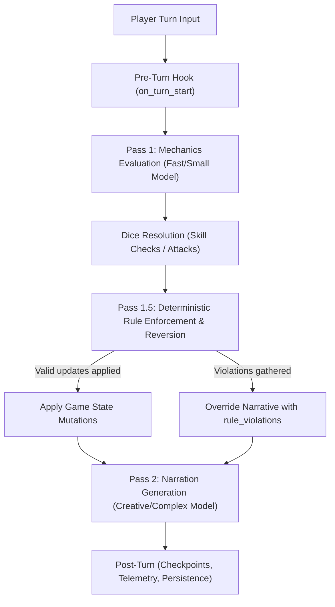

# TaleWeaver Architecture Concept

This document details the core architectural concepts of TaleWeaver for AI agents and human developers.

---

## 1. Adventure Manifest (`WorldManifesto`, `.adv`, `.adz`)

TaleWeaver adventures are represented as self-contained blueprints following specification version `1.3`:
* **`.adv`**: UTF-8 JSON file containing the complete world manifest (`WorldManifesto`).
* **`.adz`**: ZIP archive containing `adventure.adv` plus localized media in `assets/` (scene backgrounds, entity portraits, audio).

### Key Manifest Components
* **`adventure`**: World metadata, title, teaser, lore context, plot overview, tone, time pacing (`time_per_turn`, default: 5 min), rule mode (`"rpg"`, `"story"`, `"chat"`), and win/loss conditions (`completed_condition`, `gameover_condition`).
* **`protagonist`**: Avatar baseline: name, class role, HP/max HP, stamina/mana, RPG stats (`strength`, `dexterity`, `intelligence`, `wisdom`, `charisma`, `armor_class`), starting inventory, and equipped items.
* **`scenes`**: Graph nodes representing spatial locations (`id`, `label`, `description`, `image_url`).
* **`exits`**: Graph edges between scenes (`from_scene_id`, `to_scene_id`, `exit_type`, `is_locked`, `code_to_unlock`, `item_to_unlock`, `rule_to_unlock`).
* **`npcs`**: Non-player characters with spatial position, stats, inventory, hidden flag, movement type (`STATIONARY` vs `MOVABLE`), and optional TTS voice.
* **`objects`**: Interactive scene items or inventory objects (`CONTAINER`, `SWITCH`, `WEAPON`, `WEARABLE`, `CONSUMABLE`, `KEY`, `READABLE`, `CONSTRUCTABLE`). Containers support locks and nested items; switches hold finite state machines (`switch_states`, `switch_actions`).
* **`quests`**: Main and side quests with clear objectives and EXP rewards.
* **`awards`**: Achievements (`bronze`, `silver`, `gold`) evaluated during turn execution.
* **`scripts`**: Sandboxed Python event scripts reacting to triggers (`on_turn_start`, `on_enter_scene`, `on_interact`, `on_turn_end`) via the `tw` GameContext API.

---

## 2. In-Game Turn Loop & Multi-Pass Pipeline (`GameTurnManager`)

Every player turn executes through a deterministic, guardrailed multi-pass architecture in [gameplay_logic.py](file:///d:/DEV/repositories/git/taleweaver/backend/api/routes/adventures/gameplay_logic.py):

### Pre-Turn Hook: `on_turn_start`
* Sandboxed Python scripts run before player action is parsed.
* Can apply passive damage, environment effects, or trigger game over/victory conditions.

### Pass 1: Mechanics Evaluation (Small/Fast Model)
* Uses `small_model` (e.g. Gemini Flash / GPT-4o-mini) with structured output schema `GameEvent`.
* Evaluates player intent against current scene state.
* Generates requested state updates:
  * Skill checks (`requested_skill_checks`) & attacks (`requested_attacks`).
  * Entity updates (opening containers, moving items, flipping switches).
  * Exit lock state changes & proposed scene transitions (`new_scene_id`).
* **Rule**: Spontaneous/dynamic item generation is strictly disabled. Items must already exist in world/NPC definitions.

### Mechanics Resolution: Deterministic Dice Engine
* Attack rolls: Evaluated against target Armor Class (`roll_attack`).
* Skill checks: Evaluated against DC using character stats (`roll_skill_check`).
* Results are surfaced transparently to the user as system event messages.

### Pass 1.5: Rule Validation & Reversion (Critical Guardrail)
* **Design Rule**: Never parse freeform text to identify which entity or container the player is interacting with.
* Instead, systematically inspect any state updates requested by the LLM in Pass 1:
  * **Containers**: Validate if `item_to_unlock` is in the player's inventory, or if `unlock_code` matches. Enforce that key items are actively referenced.
  * **Exits & Movement**: Validate exit locks, destination scene graph connectivity, and prevent accidental teleports from hypothetical chat.
  * **Switches**: Verify state transitions match allowed `switch_states`.
  * **Constructables**: Validate that all `combination_ingredients` are present in player inventory.
  * **Hidden Entities**: Require explicit search/inspection actions before revealing hidden NPCs or items.
* **Reversion Mechanism**: Any invalid state change is immediately **reverted** back to its pre-turn database state.
* Violations are recorded into the `rule_violations` list.

### Pass 2: Narration Generation (Complex/Creative Model)
* Uses `complex_model` (e.g. Gemini Pro / Claude Opus / GPT-4o) with streaming narration.
* Injects:
  1. Technical outcome JSON (pruned `GameEvent` summary).
  2. Draft narration from Pass 1.
  3. **Critical Violation Overrides**: If `rule_violations` contains entries, `game_event.narrative_description` is replaced with the failure reason.
  4. Vocal/TTS style tags (`[excited]`, `<sigh>`, `<whisper>`) for atmospheric speech.
* **Enforcement**: This forces the creative model to narrate failure accurately rather than hallucinating success.

### Post-Turn: Persistence & Checkpoints
* Updates committed to SQLite `SessionState`.
* Checkpoints created on milestones (`SCENE_CHANGE`, `QUEST_UPDATE`, `AWARD_GRANTED`).
* Performance metrics logged via `log_structured_event` (p50/p90 latency monitoring).

---

## 3. Session State & Entity Overrides

* **Template Immutability**: `AdventureTemplate`, `WorldScene`, and `WorldEntity` templates remain unchanged during play.
* **Session State (`SessionState`)**:
  * `entity_states`: JSON dictionary recording dynamic per-entity mutations (e.g., current HP, lock states, spatial position, visibility).
  * `avatar.inventory`: Live item list carried by the player.
  * `current_scene_id`: Active player location.
* **Exit Resolution Rule**:
  * Always resolve session-scoped exits by preferring session records over template records to respect dynamic in-game unlocking.

---

## 4. Diagnostics & Inspection Tools

Always use the built-in diagnostic CLI tool rather than crafting ad-hoc SQL queries:
* **List adventures**: `python scripts/inspect_state.py list-adventures`
* **Inspect adventure & manifest**: `python scripts/inspect_state.py show-adventure "<title_or_id>" --manifest`
* **Inspect active session state**: `python scripts/inspect_state.py show-session <session_id> --inventory --entities`
* Specialized Agent Skills:
  * `taleweaver-inspector`: Deep session state and entity diagnostics.
  * `taleweaver-dev-tools`: Security keys, admin resets, thumbnail generation.
  * `taleweaver-telemetry`: LLM latency and pipeline benchmark analysis.
