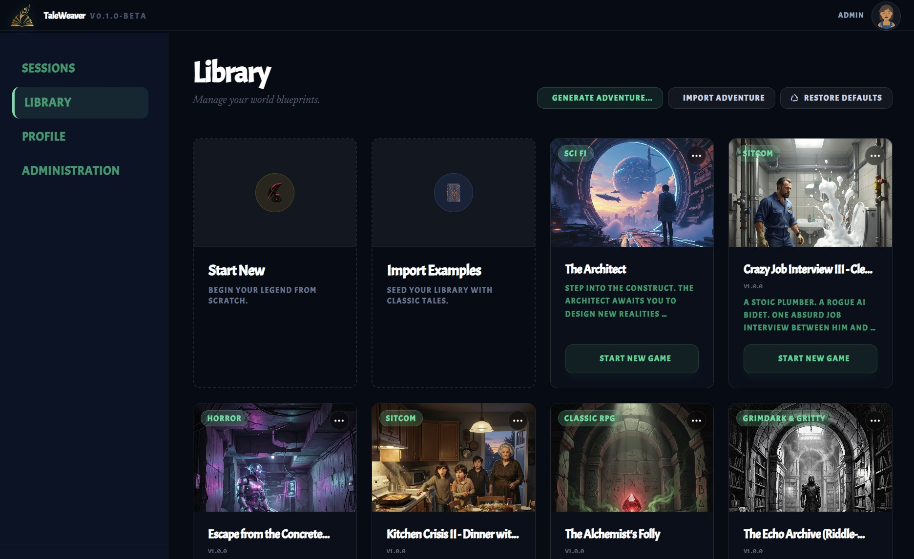
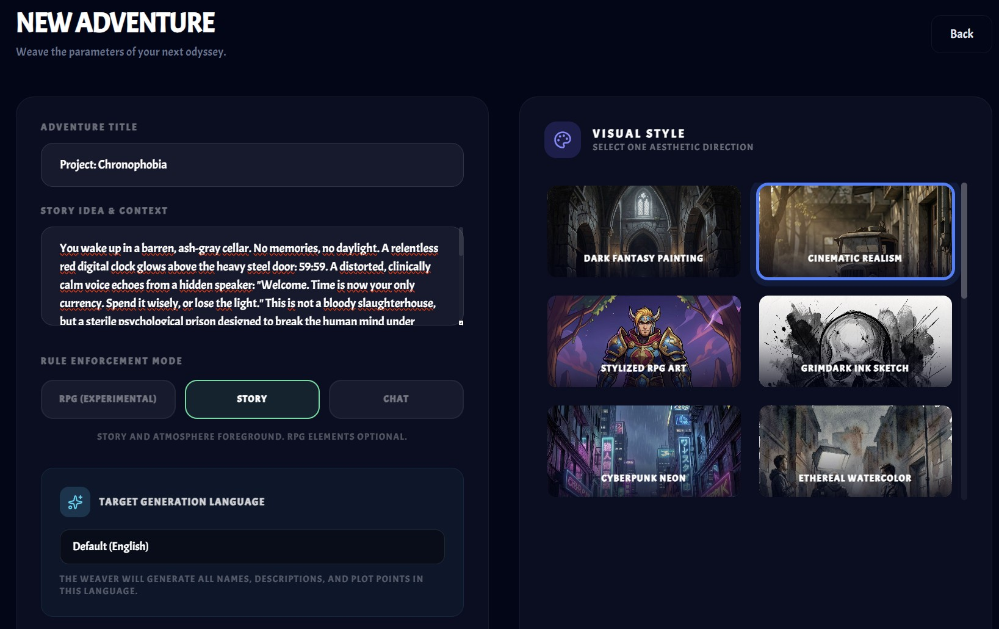
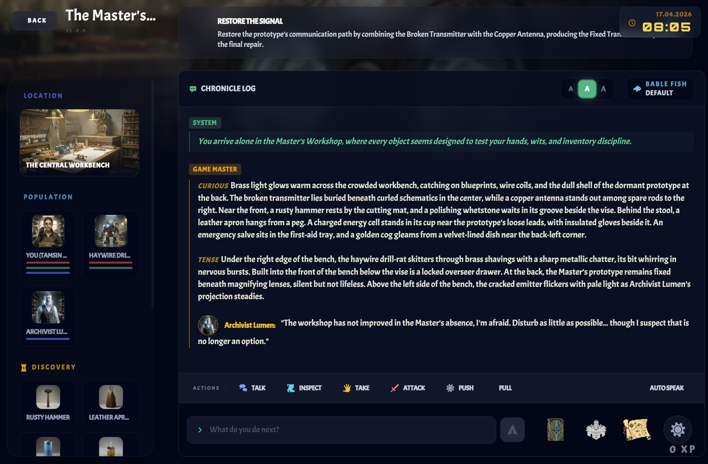
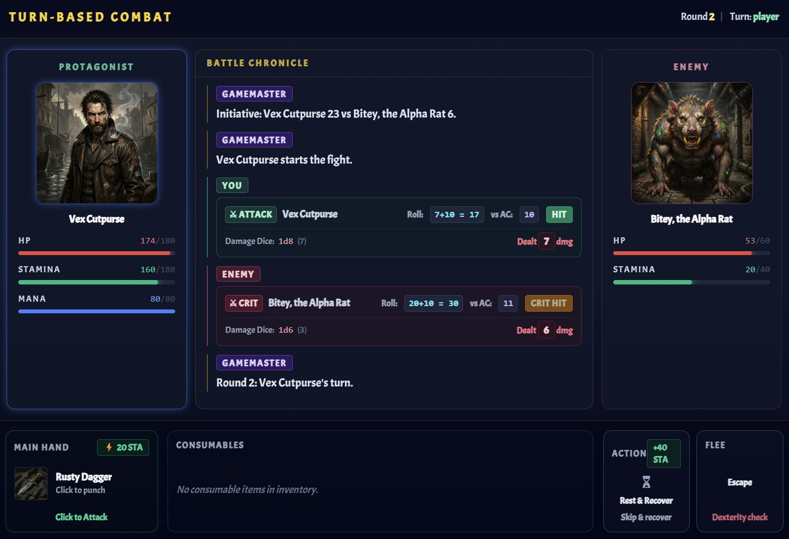

<p align="center">
  
  <br><em>Weave Infinite Adventures.</em>
</p>


# TaleWeaver: Generative AI Roleplaying

> [!IMPORTANT]
> **TaleWeaver is currently in active development.**
> As an early beta release, you may encounter unexpected behavior or creative "hallucinations." We are constantly refining the engine. Contributions and feedback are highly welcome!

**Welcome to the future of interactive storytelling.** TaleWeaver is not just another text adventure. It is a next-generation, browser-based RPG driven entirely by an **omniscient AI Gamemaster**. By combining state-of-the-art Large Language Models with cinematic Text-to-Speech (TTS), TaleWeaver dynamically generates worlds, characters, and storylines on the fly - reacting to your every decision. 

**With our immersive voice integration, playing TaleWeaver feels like directing and starring in your own playable audiobook.**

> [!TIP]
> **Put your headphones on and roleplay!** TaleWeaver works best when you immerse yourself. Don't just give commands—describe your actions, speak to NPCs, and let the AI Gamemaster narrate the consequences.

## 📸 Gallery

<p align="center">
  
  <br><em><b>Adventure Portal</b> - Manage your stories and explore new worlds.</em>
</p>

<p align="center">
  
  <br><em><b>World Generator</b> - AI-driven world building and story generation.</em>
</p>

<p align="center">
  
  <br><em><b>In-Game</b> - Immersive text adventure gameplay with dynamic AI interaction.</em>
</p>

<p align="center">
  
  <br><em><b>Combat Dialog</b> - Tactical combat interface with action choices and integrated loot resolution.</em>
</p>

## 1. The Vision

Instead of a static, predefined story, the AI acts as an intelligent, omniscient Gamemaster (GM). It generates worlds, puzzles, and storylines "on the fly," reacts dynamically to player decisions, and simultaneously manages a strict RPG rulebook in the background.

## 2. Core Features

### 🧠 The Omniscient AI Gamemaster
* **Limitless Generative Worlds:** The AI generates entire plots, puzzles, and explorable scenes "on the fly". No two playthroughs are ever the same.
* **Dynamic NPCs:** Engage in fluid, natural conversations where the AI fully embodies the persona of every character you meet. NPCs can move between scenes and have their own goals and motivations.

### 🎯 Quests & Meta-Progression
* **Dynamic Objectives:** Follow main storylines or explore optional side quests. The AI Gamemaster evaluates your actions and dynamically updates your quest log.
* **Achievement System:** Unlock custom, AI-generated awards (Bronze, Silver, Gold) for exceptional problem-solving and out-of-the-box thinking.

### ⚙️ Deep RPG Mechanics
* **Strict Rule Enforcement:** While the narrative flows freely, a strict 2-pass RPG rulebook (Mechanics + Narrative) runs in the background.
* **State Management:** Manage Hitpoints, Stamina, and Mana, while reacting to plot-driven status effects (e.g., Poisoned, Blessed).
* **Loot & Inventory System:** Dedicated isolated inventory system with specific equipment slots (Head, Chest, Rings, etc.).
* **Tactical Combat Dialog:** Dedicated combat modal with contextual actions (attack, run, rest, consume) plus integrated loot resolution flow.
* **Container Gameplay:** Containers can be generated in scenes and inventory, support locked/unlocked states, and may require a code or item condition before access.
* **Text-Log Discovery System:** Readable objects can contain structured text logs (document, scroll, book, sign) that can be opened directly from scene and inventory interactions.

### 🎧 The Playable Audiobook (Cinematic Audio)
* **Next-Gen Voice Acting:** Powered by **Google Gemini 3.1 Flash (TTS)** and **ElevenLabs**, the AI Gamemaster narrates your adventure with cinematic quality and emotional depth.
* **Director's Cut:** The engine automatically parses vocal tags and director notes to build dramatic tension[cite: 1]. It is not just reading text; it is performing a high-budget audio drama.

### 🗺️ Visuals & Sensory Immersion
* **Dynamic Cartography:** Automatic rendering of hand-drawn style directed graph maps of your discovered scenes using rough.js and dagre[cite: 1].
* **Babel Fish Multilingualism:** Generate adventures and translate narration instantly in multiple languages.
* **Cinematic Audio:** Immersive TTS support powered by Google Gemini 1.5 Flash and ElevenLabs for high-budget audio drama pacing.

### 🧠 Bring Your Own Model (BYOK) & Privacy First
* **Cloud-Tier Intelligence:** Designed to harness the reasoning power of top-tier models (GPT-5, Claude 4.5, Gemini 3 Pro) via our LiteLLM adapter for flawless, complex world generation. You provide your own API key, meaning you have full control over your data and costs.
* **Self-Hosted & Tenant-Ready:** Run the backend completely on your own hardware via Docker. Built on SQLite with UUID-based primary keys, your game progress and prompts remain local and private on your machine.
* **Local Tinkering (Experimental):** While the core engine relies on high-tier models for complex JSON generation, we offer highly experimental support for local execution via **Ollama**. Perfect for developers looking to push the boundaries of local inference, though not yet recommended for stable gameplay.

### Persistent Game Progress & Memory
* **Memory Feature:** The AI remembers all previous conversations and actions of the player within an adventure.
* **Persistence:** Progress is permanently stored in the database, allowing sessions to be paused and resumed at any time.
* **Continuous Auto-Save Milestones:** TaleWeaver now creates automatic checkpoints at major story milestones (scene changes, quest milestones, award events).
* **Chronicles Timeline + Rollback:** Open the new Chronicles timeline in-game and restore to any recent checkpoint. Rollback performs a hard timeline rewind by restoring stored state and removing future messages after that checkpoint.
* **Retention Policy:** To keep sessions fast and compact, only the five most recent checkpoints are retained per game session.

### Media & Immersion
* Optional AI-generated images to enhance the aesthetic.
* **Import/Export:** Adventures can be backed up or shared.
* **Offline Image Generation:** Local providers are supported, including **Ollama** and **Stable Diffusion via Automatic1111/Forge API**.

### Recent Feature Highlights
* **Chronicles Checkpoints + Timeline Restore** (`617f682`): Added milestone-based auto-checkpoints, a dedicated in-game Chronicles timeline, and rollback restore flow for recent session states.
* **Container Unlock Rules + Generated Containers** (`9e26e8c`, `39688df`, `0bb4c0f`): Added generated container entities with lock-state rules plus code/item-based unlock requirements.
* **Text-Log Generation + Readable Inventory Integration** (`329c835`, `dabbee3`): Added generated text logs and richer readable-item handling with content/format support in inventory and scene flows.
* **Session Notes + Combat Loot Handling** (`60214f6`): Added editable session notes in the game/portal flow and structured post-combat loot handling in the gameplay UI.
* **Enhanced Import + Session Management** (`5c4cd9b`): Improved adventure import flow and session lifecycle behavior to make play sessions more robust.
* **Ollama Model Management + Bulk Deletion Tools** (`f5f6576`): Added admin-facing Ollama model management plus portal actions for deleting all sessions/templates.
* **Path Traversal Security Hardening** (`b6c17cc`, `62eb16e`, `15f0dc5`, `91b4fd2`, `3dccb87`, `f3cfb03`, `0559f8f`, `2761c7d`): Hardened path handling across API and media routes to mitigate uncontrolled path expression risks.

---

## 🚀 Roadmap: What's Next?

TaleWeaver is evolving rapidly. Here is what we are building next to push the boundaries of AI roleplaying:

*   **Epic Campaigns (Endless Scale):** Breaking the boundaries of single adventures. We are building a system to link multiple `.adv` blueprints into massive, persistent campaigns with overarching plots and carrying over character progression.
*   **Deep Immersion Overhaul:** Upgrading the event engine for more complex NPC behaviors, advanced item crafting, and dynamic world events.
*   **100% Local TTS:** Cutting the cord to cloud audio. We will integrate local Text-to-Speech models so your adventure remains fully offline and private, matching our local Ollama vision.
*   **Voice Control & Speech-to-Text:** True hands-free roleplaying. Talk directly to the AI Gamemaster and NPCs using your microphone for the ultimate "holodeck" experience.
*   **Experience & Growth:** Complete objectives to earn EXP and progress your character's journey.
*   **Fully featured Wold-Editor. Edit every aspect of the generated world and adventures.

---

## 🚀 First Steps

To get started with your first adventure, follow these simple steps:

1.  **Configure LLM**: Navigate to **Administration** and provide an API key for your preferred provider (OpenAI, Anthropic, Gemini, or local Ollama). This is required for the AI Gamemaster.
2.  **Explore the Library**: Browse the **Library** for pre-seeded adventures or imported blueprints.
3.  **Generate a World**: If you want something unique, use the **World Generator** to create a completely new setting from a simple prompt in your preferred language (e.g., German, French, Italian).
4.  **Begin Journey**: Select your adventure and click **Begin Journey** to start playing! (Your hero's stats and appearance are automatically initialized from the adventure's protagonist definition).
5.  **Use Chronicles**: During gameplay, open **Chronicles Timeline** from the header to inspect auto-saved milestones and restore earlier points when needed.

> [!TIP]
> You can find several pre-made test adventures in the `/adventures` directory of this repository. For even more content, check out our **[Community Adventure Repository](https://github.com/jschm42/taleweaver-adventures)**! Use the **Import** button in the **Library** to load them and start playing immediately!

## 🧠 LLM Recommendations

For the best experience, we recommend using high-tier models, especially for **World Generation** and **Strict Mechanics**.

| Task | Recommended Models | Notes |
| :--- | :--- | :--- |
| **World Generation** | **GPT-5**, **Claude 4.5 Opus**, **Gemini 3 Pro** | Requires strong reasoning to generate complex, valid JSON manifests. |
| **Mechanics (Pass 1)** | **GPT-5-mini**, **Claude 4.5 Sonnet** | Best for following strict RPG rules and state modifications. |
| **Narrative (Pass 2)** | **Claude 4.5 Sonnet**, **GPT-5** | These models provide the most immersive and atmospheric prose.

> [!WARNING]
Use providers with a good latency for the world generation to avoid long wait times. 
Models like `Gemini 1.5 Flash` or `GPT-4o-mini` are excellent for quick chat responses but may occasionally struggle with the complex, deep JSON schemas required for generating entire worlds. If world generation fails repeatedly, try a more powerful "Pro" or "Sonnet" class model.
> **Regarding Local Models (Ollama):** The `WorldManifesto` schema is highly complex and requires strict JSON outputs. Currently, most local models run via Ollama struggle to consistently produce valid schemas of this depth. Use cloud models for stable generation and local models only for experimental testing.

---

## 3. Architecture & Concepts

### LLM Abstraction & Secure Key Management
* **Adapter Pattern:** Using a higher-level LLM router (e.g., `litellm`) to map providers to a standardized interface.
* **Security:** API keys entered via the frontend are encrypted (AES) before being stored in the SQLite database.

## 4. Workflows & Internal Logic

For a deeper look into the backend processes, check out the Mermaid diagrams in the `docs/diagrams` folder:
* [Adventure Generation Workflow](docs/diagrams/adventure_generation.mermaid) ([Activity Diagram](docs/diagrams/adventure_generation_activity.mermaid))
* [Game Session Loop Sequence](docs/diagrams/game_session_loop.mermaid) ([Activity Diagram](docs/diagrams/game_session_loop_activity.mermaid))

### ⚡ Quick Setup (Automatic)

The fastest way to set up TaleWeaver manually is to use the provided setup scripts. These scripts will automatically create a virtual environment, install all dependencies (backend & frontend), generate security keys in a `.env` file, and run database migrations.

#### Windows (PowerShell)
Open PowerShell as an administrator (if needed) in the project root and run:
```powershell
.\setup.ps1
```

#### Linux / macOS (Bash)
Open a terminal in the project root and run:
```bash
chmod +x setup.sh
./setup.sh
```

### 🐳 Running with Docker (Recommended)

The easiest way to get TaleWeaver up and running is using Docker. This method packages both the frontend and backend into a single container and handles all dependencies automatically.

#### Prerequisites
- [Docker](https://docs.docker.com/get-docker/) installed and running.
- [Docker Compose](https://docs.docker.com/compose/install/) (usually included with Docker Desktop).

#### Quick Start

1.  **Clone the repository:**
    ```bash
    git clone https://github.com/jschm42/taleweaver.git
    cd taleweaver
    ```

2.  **Run the setup script:**
    -   **Linux/macOS:** `bash scripts/docker-setup.sh`
    -   **Windows:** `scripts\docker-setup.bat`

3.  **Configure Environment:**
    The setup script will create a `.env` file from `.env.example`. Open it and set your `ENCRYPTION_KEY`. (You can generate one using `python scripts/generate_fernet_key.py` or use any persistent 32-byte base64 string).

4.  **Access the App:**
    Open your browser and go to `http://localhost:8000`.

#### Persistence & Data
The Docker setup uses a **bind mount** to the `./data` directory on your host machine. This ensures that:
- Your SQLite database (`taleweaver.db`) and all game progress persist between restarts.
- Generated character images and logs are saved on your host.
- The bundled adventures in `/adventures` are automatically imported on the first start.

#### Updating
To update to the latest version and rebuild the container:
```bash
bash scripts/docker-update.sh
```

### 🛠️ Manual Development Setup

If you prefer to run the components separately for development:

#### System Requirements
- **Python:** 3.13 (specified via `.python-version` file)
- **Node.js:** 18+ (for the Vue.js frontend MVP)
- **Package Managers:** `pip` and `npm`
- **Database:** SQLite (built-in, no separate server needed)
- **LLM Provider:** An active API key from an LLM provider (e.g., OpenAI, Anthropic, Gemini) is required for the AI Gamemaster.

### Installation & Execution

The project is split into a Python/FastAPI backend and a Vue.js frontend.

#### 1. Backend Setup
Navigate to the project root directory, create a virtual environment, and install dependencies:

```bash
# Create and activate a virtual environment
python -m venv venv

# On Windows:
venv\Scripts\activate
# On Linux/macOS:
source venv/bin/activate

# Install requirements
python -m pip install -r requirements.txt

# Set up your environment variables
cp .env.example .env

# Generate a secure ENCRYPTION_KEY and follow the script's instructions
# to place the generated key into your new .env file
python scripts/generate_fernet_key.py

# Apply database migrations
python -m alembic upgrade head

# Optional hard reset for local development (SQLite file lives in data/)
# delete data/taleweaver.db and run migrations again

# If a previous migration crashed and left temp tables behind, clean and retry:
# python -c "import sqlite3; c=sqlite3.connect('data/taleweaver.db'); c.execute('DROP TABLE IF EXISTS _alembic_tmp_adventures'); c.execute('DROP TABLE IF EXISTS _alembic_tmp_users'); c.execute('DROP TABLE IF EXISTS _alembic_tmp_avatars'); c.commit(); c.close()"
# python -m alembic upgrade head

# Start the FastAPI server (uses BACKEND_PORT from .env)
python -m backend.main


#### ⚡ Start the Backend Server (Uvicorn)
Start the FastAPI application with automatic reloading on change:

uvicorn backend.main:app --reload --port 8000
```

Important: Run this command from the project root. Running it from inside the backend directory causes import errors like ModuleNotFoundError: No module named backend.

If you see SQLite errors such as no such column after model changes, recreate the local database file data/taleweaver.db (or run your migration flow) so the schema matches the current models.

The backend API will run on the port configured in `.env` (default: `http://localhost:8000`).
The frontend will run on the port configured in `.env` (default: `http://localhost:5173`).

#### Windows Quick Start (PowerShell)

> [!TIP]
> Use the automated `.\setup.ps1` script (described in the Quick Setup section) for a much faster and less error-prone installation!

If you want a copy-paste setup for Windows PowerShell from the project root:

```powershell
# Backend terminal
python -m venv venv
.\venv\Scripts\Activate.ps1
python -m pip install -r requirements.txt
python -m alembic upgrade head
python -m backend.main
```

```powershell
# Frontend terminal
cd frontend
npm install
npm run dev
```

#### 2. Frontend Setup
Navigate to the frontend directory to set up the Vue.js interface:

```bash
cd frontend

# Install UI dependencies
npm install

# Start the development server
npm run dev
```
The frontend will typically run on `http://localhost:5173`.

#### 3. First Launch
Once both servers are running, open the frontend URL in your browser. You will be prompted in the settings/configuration UI to provide your LLM API key. This key is encrypted using AES and stored safely in your local SQLite database before you can start generating your first adventure.

### Local Image Generation (Offline): Ollama + Stable Diffusion API

TaleWeaver supports offline image generation through local providers in `Configuration -> Visuals`.

#### Option A: Ollama (Local, Experimental)

1. Install and run Ollama.
2. Pull an image model, for example:

```bash
ollama pull x/flux2-klein
```

3. In the frontend `Configuration -> Visuals` section:
	- Set `Image Provider` to `Ollama (Local, Experimental)`.
	- Set `Simple Image Model` and `Advanced Image Model` (default recommendation: `x/flux2-klein`).
	- Set `Ollama URL` (default: `http://localhost:11434`).
	- Optionally set `width`, `height`, `steps`, `seed`, and `negative_prompt`.

#### Option B: Stable Diffusion API (Automatic1111/Forge)

1. Start a local Automatic1111 or Forge WebUI instance with API enabled.
2. Ensure the API is reachable (default: `http://127.0.0.1:7860`).
3. In the frontend `Configuration -> Visuals` section:
  - Set `Image Provider` to `Stable Diffusion (Local)`.
  - Set `Stable Diffusion API URL` (default: `http://127.0.0.1:7860`).
  - Click `Refresh Models` to load available checkpoints from the local API.
  - Select `Simple Image Model` and `Advanced Image Model` from the fetched model list.
  - Optionally set `width`, `height`, `steps`, `seed`, and `negative_prompt`.

Notes:
- No cloud API key is required for local Ollama image generation.
- TaleWeaver first tries image generation via LiteLLM integration and falls back to direct Ollama HTTP calls when needed.
- No cloud API key is required for local Stable Diffusion generation via Automatic1111/Forge.
- TaleWeaver can query available local SD checkpoints and generate images over the local `sdapi` endpoints.

## 6. Automated Adventure Import

TaleWeaver features an automated pipeline to seed the database with adventures or import shared content on startup.

### Supported Formats
* **`.adv` (JSON):** Adventure blueprint as plain JSON (no bundled assets).
* **`.adz` (ZIP):** "Adventure Zip" containing the same blueprint JSON as `adventure.adv` plus optional bundled assets in `assets/`.

Both formats use the same top-level blueprint structure and must include format metadata:
* `format`: `taleweaver.adz`
* `version`: currently `1.0`

### Format Versioning
* Every exported file is versioned.
* On import, the backend validates `format` and `version`.
* If a file version is below the minimum supported version, import is rejected with an explicit error (HTTP 400), e.g.:
	* `Import version 0.9 is too old. Minimum supported version is 1.0.`

### Watch Directories
The backend monitors three specific directories relative to the project root:

1.  **`adventures/`**: Bundled adventures that are **committed to the repository**. This is the primary location for core adventures that should be available on every installation. Files are **never deleted**.
2.  **`data/presets/adventures/`**: Local presets or examples. This folder is ignored by git. Files are **never deleted**.
3.  **`data/imports/adventures/`**: For manual "drop-in" imports. Files in this folder are **automatically deleted** once successfully imported to keep the workspace clean.

### How it Works
* The import process runs every time the FastAPI backend starts.
* **One-Time Seed:** Adventures in the root `adventures/` folder are only imported if the database is currently empty (e.g., first start or after a reset). This allows users to delete bundled adventures from the UI without them reappearing on every restart.
* **Deduplication:** For other folders, the system checks the adventure title. If an adventure with the same title already exists, the import is skipped.
* **Asset Handling:** For `.adz` files, assets are automatically extracted and remapped to the local storage, ensuring images are available immediately.

### Portal Import/Export
* In the portal adventure card menu, each adventure can be exported as both `.adv` and `.adz`.
* The portal import action accepts both `.adv` and `.adz`:
	* Use `.adv` when you only need the blueprint JSON.
	* Use `.adz` when you also want to include packaged assets.

### 🌍 Community Adventures
Looking for more worlds to explore? We maintain a dedicated repository for community-created and curated adventure blueprints:
👉 **[taleweaver-adventures](https://github.com/jschm42/taleweaver-adventures)**

You can download `.adv` or `.adz` files from there and import them into your local TaleWeaver instance to start your journey instantly.

## 7. Credits & Assets

* **AI & LLM:** Image generation is powered by **FLUX.1 [schnell]** and **FLUX.2 [klein]** by [Black Forest Labs](https://blackforestlabs.ai/). Multi-provider LLM abstraction is handled via [LiteLLM](https://github.com/BerriAI/litellm).
* **Voice & TTS:** Cinematic narration provided by **Google Gemini 1.5 Flash (TTS)** and **ElevenLabs**.
* **Mapping:** Dynamic hand-drawn world maps are rendered using [rough.js](https://roughjs.com/) and [dagre](https://github.com/dagrejs/dagre).
* **Visual Assets:** Special thanks to [Recraft.ai](https://www.recraft.ai) for the high-quality vector graphics and SVG assets, and [DiceBear](https://www.dicebear.com/) for the procedural user avatars.
* **Icons:** RPG-specific iconography provided by [RPG-Awesome](https://nagoshiashumari.github.io/Rpg-Awesome/) and system icons by [Lucide](https://lucide.dev/).
* **Typography:** Retro pixel-art and fantasy aesthetics powered by the **Press Start 2P**, **Acme**, and **Orbitron** fonts from [Google Fonts](https://fonts.google.com/) (SIL Open Font License).

## 8. License

This project is licensed under the **MIT License** - see the [LICENSE](LICENSE) file for details.

AI-generated content (images and text) produced by this application is subject to the terms of the respective model providers. For **Black Forest Labs FLUX.1 [schnell]** and **FLUX.2 [klein]**, commercial use is permitted under the Apache 2.0 license. Please be aware that the copyrightability of AI-generated content is subject to legal interpretation in your local jurisdiction.
