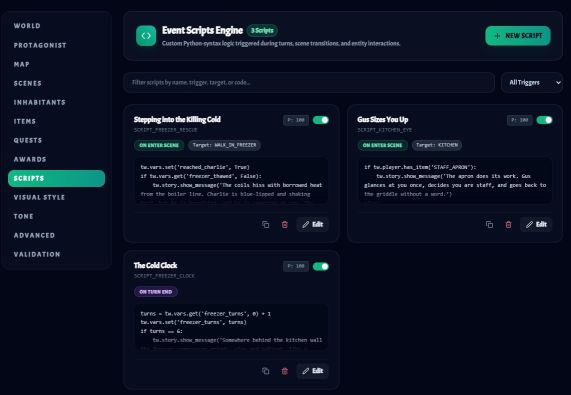
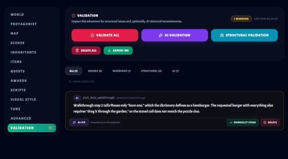
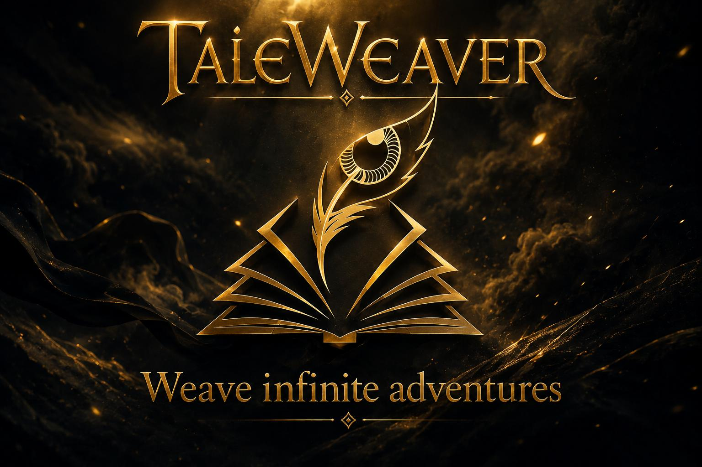

# TaleWeaver Screenshot Gallery & Explanations

This document provides concise overviews and explanations for each screenshot located in `docs/screenshots/`. These images highlight key aspects of TaleWeaver, including player gameplay, interactive modals, creator authoring tools, and branding assets.

---

## Table of Contents

- [Core Gameplay & Player Interfaces](#core-gameplay--player-interfaces)
  - [Adventure Library (`library.jpg`)](#adventure-library-libraryjpg)
  - [World Generator (`generator.jpg`)](#world-generator-generatorjpg)
  - [Adventure Gameplay (`gameplay.jpg`)](#adventure-gameplay-gameplayjpg)
  - [Character Sheet & Backpack (`character-sheet.jpg`)](#character-sheet--backpack-character-sheetjpg)
  - [Combat Encounter Dialog (`combat-dialog.jpg`)](#combat-encounter-dialog-combat-dialogjpg)
  - [Loot & Container Dialog (`loot-dialog.jpg`)](#loot-dialog-loot-dialogjpg)
- [World Editor & Authoring Suite](#world-editor--authoring-suite)
  - [Editor: Scenes Workbench (`editor-scenes.jpg`)](#editor-scenes-workbench-editor-scenesjpg)
  - [Editor: Inhabitants Workbench (`editor-npcs.jpg`)](#editor-inhabitants-workbench-editor-npcsjpg)
  - [Editor: Items & Objects (`editor-items.jpg`)](#editor-items--objects-editor-itemsjpg)
  - [Editor: World Map View (`editor-map.jpg`)](#editor-world-map-view-editor-mapjpg)
  - [Editor: Event Scripts Engine (`editor-script-engine.jpg`)](#editor-event-scripts-engine-editor-script-enginejpg)
  - [Editor: Adventure Validation (`editor-validation.jpg`)](#editor-adventure-validation-editor-validationjpg)
- [Branding & Media](#branding--media)
  - [Intro Video Banner (`taleweaver_logo_with_playbutton.jpg`)](#intro-video-banner-taleweaver_logo_with_playbuttonjpg)
  - [Official Logo & Brand Banner (`taleweaver_logo_with_title.jpg`)](#official-logo--brand-banner-taleweaver_logo_with_titlejpg)

---

## Core Gameplay & Player Interfaces

### Adventure Library (`library.jpg`)

* **Filename**: [`docs/screenshots/library.jpg`](screenshots/library.jpg)
* **View**: Main Adventure Hub & Campaign Selector
* **Description**:
  The central portal for browsing and managing adventures. Players can explore curated campaigns, community modules, and locally generated scenarios. Each adventure card presents custom cover artwork, setting summaries, play session statistics, and action triggers to start, resume, clone, or open the campaign directly inside the World Editor.

---

### World Generator (`generator.jpg`)

* **Filename**: [`docs/screenshots/generator.jpg`](screenshots/generator.jpg)
* **View**: AI-Powered World Generation Setup
* **Description**:
  The creative initiation console for generating fully fleshed-out RPG adventures from natural language prompts. Users can configure narrative genre, thematic tone, visual art styles (such as dark fantasy, retro pulp, or cyberpunk), quest complexity, and world scope before the LLM synthesis pipeline constructs scenes, inhabitants, items, and initial storylines.

---

### Adventure Gameplay (`gameplay.jpg`)

* **Filename**: [`docs/screenshots/gameplay.jpg`](screenshots/gameplay.jpg)
* **View**: Interactive Comic-Strip Storytelling Interface
* **Description**:
  The primary gameplay screen combining generative narrative prose with an illustrated comic-strip presentation. Responses from the omniscient AI Gamemaster and non-player characters are rendered with expressive portrait avatars, scene environment illustrations, integrated text-to-speech audio controls, and an input action bar for free-form roleplay or suggested decisions.

---

### Character Sheet & Backpack (`character-sheet.jpg`)

* **Filename**: [`docs/screenshots/character-sheet.jpg`](screenshots/character-sheet.jpg)
* **View**: Protagonist Attributes & Inventory Modal
* **Description**:
  A comprehensive HUD displaying the protagonist's core status. It provides real-time gauges for Health Points (HP), Stamina (STA), and Mana Points (MP), active status effects or ailments, equipped gear slots (such as weapons and armor), and an interactive 24-slot backpack grid for managing acquired potions, quest items, and treasures.

---

### Combat Encounter Dialog (`combat-dialog.jpg`)

* **Filename**: [`docs/screenshots/combat-dialog.jpg`](screenshots/combat-dialog.jpg)
* **View**: Turn-Based Tactical Combat System
* **Description**:
  The battle encounter modal engaged when entering combat with hostile entities. It displays combatant vitals, tactical actions (basic attack, defense stance, spellcasting, fleeing), and a transparent combat chronicle logging turn-by-turn dice roll outcomes, hit modifiers, and applied status damage.

---

### Loot & Container Dialog (`loot-dialog.jpg`)

* **Filename**: [`docs/screenshots/loot-dialog.jpg`](screenshots/loot-dialog.jpg)
* **View**: Container Inspection & Spoils Modal
* **Description**:
  An interaction modal displayed when searching environmental containers, chests, or fallen adversaries. Features rich item cards with rarity tiers, descriptive lore, and quick-action buttons allowing players to inspect specific items, retrieve individual relics, or transfer all contents into their backpack.

---

## World Editor & Authoring Suite

### Editor: Scenes Workbench (`editor-scenes.jpg`)

* **Filename**: [`docs/screenshots/editor-scenes.jpg`](screenshots/editor-scenes.jpg)
* **View**: World Editor &mdash; Scenes Tab
* **Description**:
  The worldbuilding hub for defining and organizing locations. Authors can craft scene descriptions, specify ambient lighting and environmental sound cues, establish starting scene anchors, and configure directional exits and conditional travel gates between adjacent chambers.

---

### Editor: Inhabitants Workbench (`editor-npcs.jpg`)

* **Filename**: [`docs/screenshots/editor-npcs.jpg`](screenshots/editor-npcs.jpg)
* **View**: World Editor &mdash; Inhabitants Tab
* **Description**:
  The NPC and creature management workshop. Creators can define character backstories, roleplaying motivations, tone profiles, starting scene assignments, combat stats, faction relationships, and inventory loadouts to power lifelike generative interactions.

---

### Editor: Items & Objects (`editor-items.jpg`)

* **Filename**: [`docs/screenshots/editor-items.jpg`](screenshots/editor-items.jpg)
* **View**: World Editor &mdash; Items Tab
* **Description**:
  The item cataloging workbench for managing weapons, consumables, lore scrolls, containers, and environmental switches. Creators can define pickup constraints, usability requirements, item effects, and interactive scripting hooks.

---

### Editor: World Map View (`editor-map.jpg`)

* **Filename**: [`docs/screenshots/editor-map.jpg`](screenshots/editor-map.jpg)
* **View**: World Editor &mdash; Map Topology Graph
* **Description**:
  An interactive, zoomable node graph visualizing the adventure's spatial structure. Displays all rooms as interconnected nodes, highlights the campaign's starting scene, identifies locked passageways, and allows creators to review spatial flow and identify orphan locations or unreachable areas.

---

### Editor: Event Scripts Engine (`editor-script-engine.jpg`)

* **Filename**: [`docs/screenshots/editor-script-engine.jpg`](screenshots/editor-script-engine.jpg)
* **View**: World Editor &mdash; Python-Syntax Script Engine
* **Description**:
  A safe, sandboxed scripting console for complex game mechanics and quest puzzles. Authors can write custom Python-syntax logic triggered by game events (e.g., scene entry, turn completion, item usage) using the standard TaleWeaver runtime API (`tw.vars`, `tw.player`, `tw.story`).

---

### Editor: Adventure Validation (`editor-validation.jpg`)

* **Filename**: [`docs/screenshots/editor-validation.jpg`](screenshots/editor-validation.jpg)
* **View**: World Editor &mdash; Dual-Tier Validation Suite
* **Description**:
  An automated quality assurance suite that inspects adventures for structural integrity (missing keys, dead exits, invalid links) and uses LLM semantic validation to flag narrative plot holes, conflicting puzzle clues, or narrative dead-ends. Includes one-click AI fix suggestions to resolve inconsistencies directly.

---

## Branding & Media

### Intro Video Banner (`taleweaver_logo_with_playbutton.jpg`)

* **Filename**: [`docs/screenshots/taleweaver_logo_with_playbutton.jpg`](screenshots/taleweaver_logo_with_playbutton.jpg)
* **View**: Video Teaser / Gameplay Showcase Graphic
* **Description**:
  Promotional artwork featuring the TaleWeaver golden tome and celestial quill logo overlaid with a media play symbol. Used across the project documentation and README to link directly to the YouTube gameplay introduction video.

---

### Official Logo & Brand Banner (`taleweaver_logo_with_title.jpg`)

* **Filename**: [`docs/screenshots/taleweaver_logo_with_title.jpg`](screenshots/taleweaver_logo_with_title.jpg)
* **View**: Official Key Art & Brand Identity Banner
* **Description**:
  The high-resolution key art for TaleWeaver, highlighting the gilded grimoire emblem, all-seeing eye feather quill, illuminated golden typography, and the core motto: *"Weave infinite adventures."*
